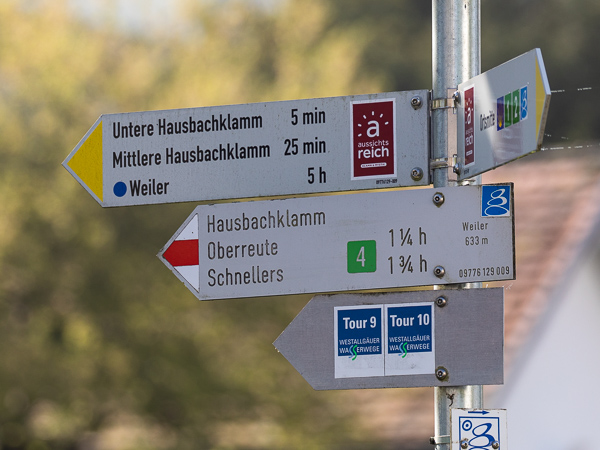
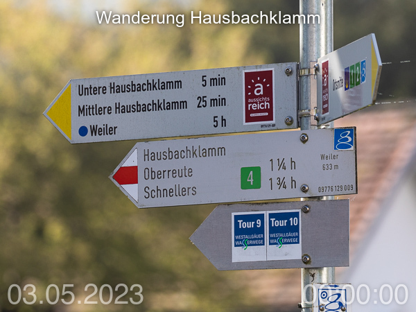
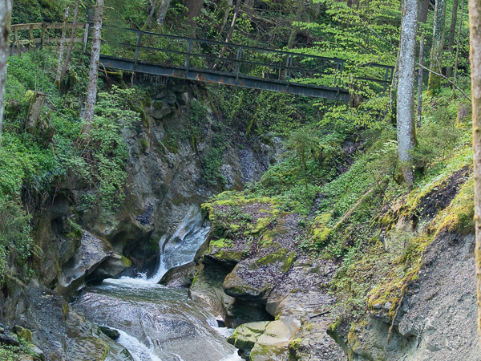
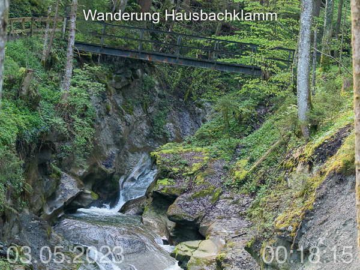
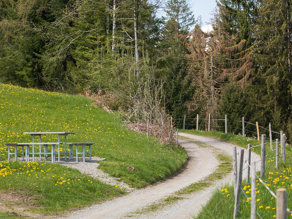
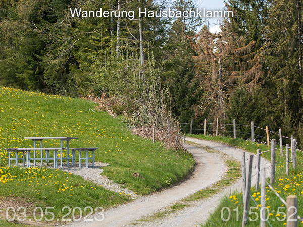

# Example A - Add Watermarks

Add watermarks.

## Result

Original          |  Result
:-------------------------:|:-------------------------:
 | 
 | 
 | 

## Instructions

Change to `photo-watermarks-with-zsh-main` directory

    cd <my projects>/photo-watermarks-with-zsh-main

Create an animated `WebP` from the [photo series](./Photos/)

    backup="$(date +%s)"; mkdir -p "Backup/$backup"; mv Example "Backup/$backup"; mkdir Example
    cp -r ExampleA/Photos Example
    ./src/run.zsh

Output:

        1 image files updated
    ...
    New photo created from original ER6A2922.jpg with watermark: <my projects>/src/../Example/<timestamp>/Photos/Watermarked/file-000003.jpg

Find the newly created photos here: `<my projects>/src/../Example/<timestamp>/Photos/Watermarked`.
 