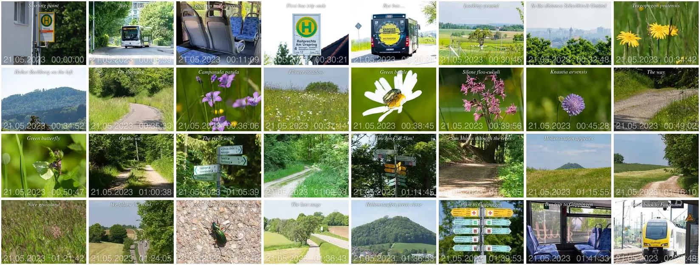

# Example B - Photo series with different time zones

Add watermarks and build an animated WebP from a [photo series](./Photos/).

Since the photos are quite small, it makes sense to change the font size: Search for `-pointsize` in the script `wm.zsh` and change it to a smaller value accordingly.

## Result

Animated `Webp` file.

| Frames Grid Preview |
| :---: |
|  |

## Instruction

Change to `photo-watermarks-with-zsh-main` directory

    cd <my projects>/photo-watermarks-with-zsh-main

Save the "Example" directory and copy the example files into a newly created "Example" directory:

    backup="$(date +%s)"; mkdir -p "Backup/$backup"; mv Example "Backup/$backup"; mkdir Example 
    cp -r ExampleB/Photos Example

Run the script to create animated `WebP`:

    ./src/run.zsh -webpanim

Only works on the macOS platform: open the newly created WebP files in the Safari browser like this:

    open -a "Safari" $(print ./Example/[[:digit:]]#/Photos/Watermarked/animation.webp(-om[1,1]))

On other platforms, find the path to the newly created WebP file, from where you drag it into a browser, this way:

    print ./Example/[[:digit:]]#/Photos/Watermarked/animation.webp(-om[1,1])