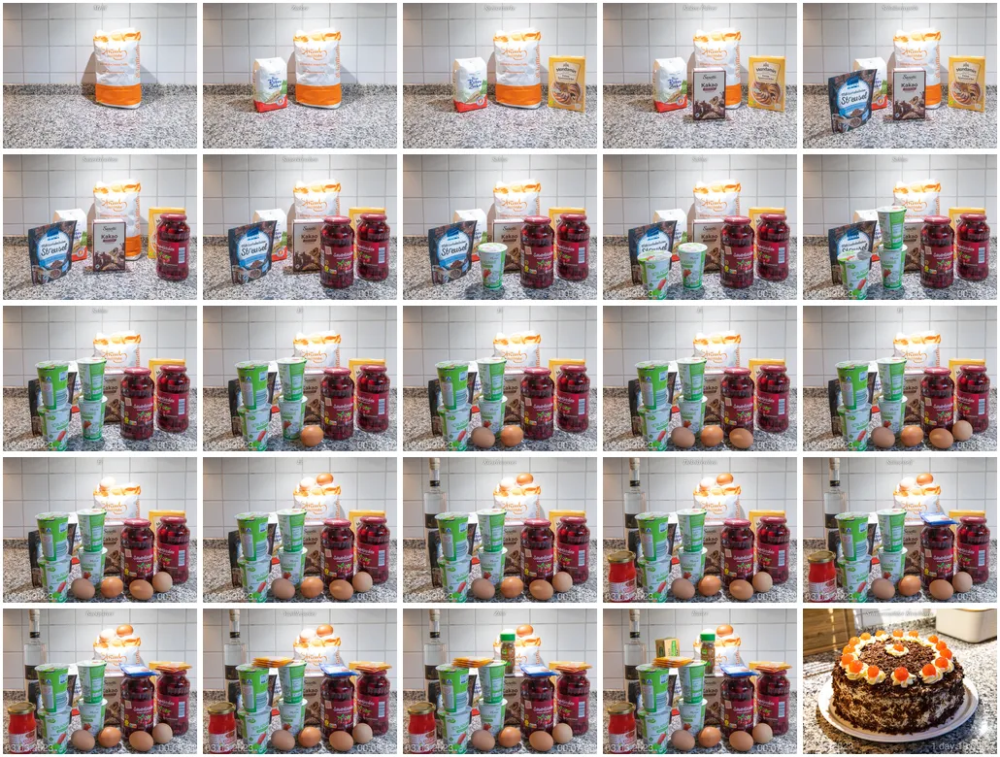

# Example C - Animated Gif and WebP

Create an animated `WebP` and `Gif` from a [photo series](./Photos/).

Photos have an additional keyword tags `MS` with numeric values indicating how long the photo is displayed in a animated `WebP` in `[ms]`. 

The `MS` tag and value is ignored for the animated `Gif`.

## Result

Animated `Gif` and `Webp` files.

| Frames Grid Preview |
| :---: |
|  |

## Instruction

Change to `photo-watermarks-with-zsh-main` directory

    cd <my projects>/photo-watermarks-with-zsh-main

Save the "Example" directory and copy the example files into a newly created "Example" directory:

    backup="$(date +%s)"; mkdir -p "Backup/$backup"; mv Example "Backup/$backup"; mkdir Example 
    cp -r ExampleC/Photos Example

Run the script to create animated `WebP` and `Gif`:

    ./src/run.zsh -gifanim -webpanim -noelapsedtimewm -nodatewm

Only works on the macOS platform: open the newly created WebP files in the Safari browser like this:

    open -a "Safari" $(print ./Example/[[:digit:]]#/Photos/Watermarked/animation.webp(-om[1,1]))
    open -a "Safari" $(print ./Example/[[:digit:]]#/Photos/Watermarked/animation.gif(-om[1,1]))

On other platforms, you find the path to the newly created Gif and WebP files, from where you can drag it into a browser window, this way:

    print ./Example/[[:digit:]]#/Photos/Watermarked/animation.webp(-om[1,1])
    print ./Example/[[:digit:]]#/Photos/Watermarked/animation.gif(-om[1,1])