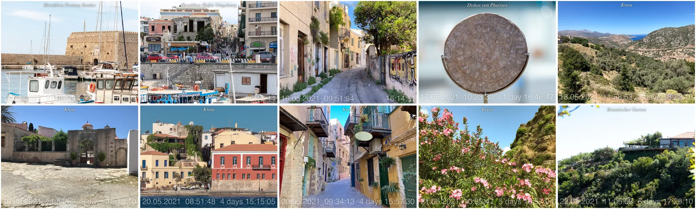

# Example D -  Set the time zone

Create an animated `WebP` from a [photo series](./Photos/).

Photos have different time zone settings, some are +1 others +3, they are all set to the time zone set by the argument and an animated `WebP` is created.

## Result

Animated `Webp` file.

| Frames Grid Preview Timezone = +3 |
| :---: |
|  |

| Frames Grid Preview Timezone = -4 |
| :---: |
|  |

## Instruction

Change to `photo-watermarks-with-zsh-main` directory

    cd <my projects>/photo-watermarks-with-zsh-main

Save the "Example" directory and copy the example files into a newly created "Example" directory:

    backup="$(date +%s)"; mkdir -p "Backup/$backup"; mv Example "Backup/$backup"; mkdir Example 
    cp -r ExampleD/Photos Example

Run the script with timezone set to `+3`:

    ./src/run.zsh -tz3 -webpanim -timewm

Run the script with timezone set to `-4`:

    ./src/run.zsh -tz-4 -webpanim -timewm

Only works on the macOS platform: open the newly created WebP files in the Safari browser like this:

    open -a "Safari" $(print ./Example/[[:digit:]]#/Photos/Watermarked/animation.webp(-om[1,1]))
    open -a "Safari" $(print ./Example/[[:digit:]]#/Photos/Watermarked/animation.webp(-om[2,2]))

On other platforms, find the path to the newly created WebP files, from where drag it into a browser, this way:

    print ./Example/[[:digit:]]#/Photos/Watermarked/animation.webp(-om[1,1])
    print ./Example/[[:digit:]]#/Photos/Watermarked/animation.webp(-om[2,2])
