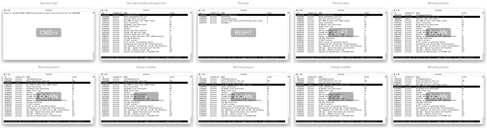

# Example E -  Creating a screencast from a screenshot series

Create a "screencast" as an animated `WebP` from a [screenshot series](./Photos/).

## Result

Animated `Webp` file.

| Frames Grid Preview |
| :---: |
|  |

## Instruction

Change to `photo-watermarks-with-zsh-main` directory

    cd <my projects>/photo-watermarks-with-zsh-main

Save the "Example" directory and copy the example files into a newly created "Example" directory:

    backup="$(date +%s)"; mkdir -p "Backup/$backup"; mv Example "Backup/$backup"; mkdir Example
    cp -r ExampleE/Photos Example

Add Exif tags and values for title, duration for each frame and keystroke information:

    exiftool -P -m -Keywords="TI:Start the script,NC:CMD-v,MS:1000" -overwrite_original ./Example/Photos/img_1686487311.png
    exiftool -P -m -Keywords="TI:View after loading the project list,NC:,MS:500" -overwrite_original ./Example/Photos/img_1686487319.png
    exiftool -P -m -Keywords="TI:Next page,NC:RIGHT,MS:500" -overwrite_original ./Example/Photos/img_1686487328.png
    exiftool -P -m -Keywords="TI:Previous page,NC:LEFT,MS:500" -overwrite_original ./Example/Photos/img_1686487333.png
    exiftool -P -m -Keywords="TI:Browsing projects,NC:DOWN,MS:200" -overwrite_original ./Example/Photos/img_1686487338.png
    exiftool -P -m -Keywords="TI:Browsing projects,NC:DOWN,MS:200" -overwrite_original ./Example/Photos/img_1686487343.png
    exiftool -P -m -Keywords="TI:Change visibility,NC:s,MS:500" -overwrite_original ./Example/Photos/img_1686487347.png
    exiftool -P -m -Keywords="TI:Browsing projects,NC:DOWN,MS:500" -overwrite_original ./Example/Photos/img_1686487352.png
    exiftool -P -m -Keywords="TI:Change visibility,NC:s,MS:500" -overwrite_original ./Example/Photos/img_1686487356.png
    exiftool -P -m -Keywords="TI:Browsing projects,NC:DOWN,MS:200" -overwrite_original ./Example/Photos/img_1686487359.png
    exiftool -P -m -Keywords="TI:Browsing projects,NC:DOWN,MS:200" -overwrite_original ./Example/Photos/img_1686487363.png
    exiftool -P -m -Keywords="TI:Browsing projects,NC:DOWN,MS:200" -overwrite_original ./Example/Photos/img_1686487368.png
    exiftool -P -m -Keywords="TI:Browsing projects,NC:DOWN,MS:200" -overwrite_original ./Example/Photos/img_1686487370.png
    exiftool -P -m -Keywords="TI:Browsing projects,NC:DOWN,MS:200" -overwrite_original ./Example/Photos/img_1686487375.png
    exiftool -P -m -Keywords="TI:Change visibility,NC:s,MS:500" -overwrite_original ./Example/Photos/img_1686487379.png
    exiftool -P -m -Keywords="TI:Browsing projects,NC:DOWN,MS:500" -overwrite_original ./Example/Photos/img_1686487381.png
    exiftool -P -m -Keywords="TI:Change visibility,NC:s,MS:500" -overwrite_original ./Example/Photos/img_1686487384.png
    exiftool -P -m -Keywords="TI:Update on GitLab,NC:u,MS:500" -overwrite_original ./Example/Photos/img_1686487392.png
    exiftool -P -m -Keywords="TI:Updating,NC:,MS:200" -overwrite_original ./Example/Photos/img_1686487393.png
    exiftool -P -m -Keywords="TI:Updating,NC:,MS:200" -overwrite_original ./Example/Photos/img_1686487395.png
    exiftool -P -m -Keywords="TI:Updating,NC:,MS:200" -overwrite_original ./Example/Photos/img_1686487397.png
    exiftool -P -m -Keywords="TI:Update done,NC:,MS:500" -overwrite_original ./Example/Photos/img_1686487399.png

Run the script:

    ./src/run.zsh -ext png -noelapsedtimewm -nodatewm -webpanim -nfcwm

Only works on the macOS platform: open the newly created WebP file in the Safari browser like this:

    open -a "Safari" $(print ./Example/[[:digit:]]#/Photos/Watermarked/animation.webp(-om[1,1]))

On other platforms, you find the path of the newly created WebP file, from where you can drag it into a browser window, this way::

    print ./Example/[[:digit:]]#/Photos/Watermarked/animation.webp(-om[1,1])