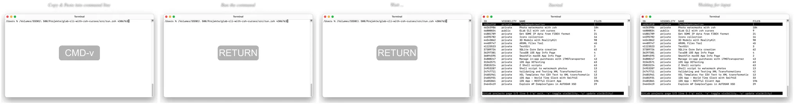

# Example F -  Creating an animated WebP with an image that is used several times as a frame

Create an animated `WebP` from a [screenshot series](./Photos/).

Use the same original image several times as a frame in the animated WebP with different titles, display durations, etc.

## Result

Animated `Webp` file.

| Frames Grid Preview |
| :---: |
|  |

## Instruction

Change to `photo-watermarks-with-zsh-main` directory

    cd <my projects>/photo-watermarks-with-zsh-main

Save the "Example" directory and copy the example files into a newly created "Example" directory:

    backup="$(date +%s)"; mkdir -p "Backup/$backup"; mv Example "Backup/$backup"; mkdir Example
    cp -r ExampleF/Photos Example

Add Exif tags and values for title, duration for each frame and keystroke information:

    exiftool -P -m -Keywords="TI:Copy & Paste into command line,NC:CMD-v,MS:500,TI:Run the command,NC:RETURN,MS:500,TI:Wait ...,NC:RETURN,MS:1000" -overwrite_original ./Example/Photos/img_1686487311.png
    exiftool -P -m -Keywords="TI:Started,NC:,MS:500,TI:Waiting for input,NC:,MS:1000" -overwrite_original ./Example/Photos/img_1686487319.png

Run the script:

    ./src/run.zsh -ext png -noelapsedtimewm -nodatewm -webpanim -nfcwm

Only works on the macOS platform: open the newly created WebP file in the Safari browser like this:

    open -a "Safari" $(print ./Example/[[:digit:]]#/Photos/Watermarked/animation.webp(-om[1,1]))

On other platforms, you find the path to the newly created WebP file, from where you can drag it into a browser window, this way::

    print ./Example/[[:digit:]]#/Photos/Watermarked/animation.webp(-om[1,1])

