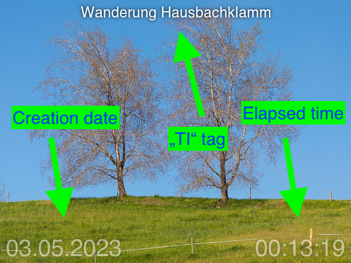
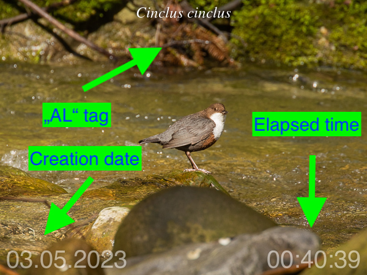
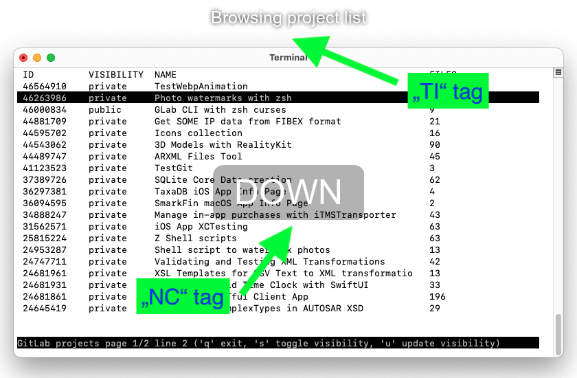

# Fotos mit Wasserzeichen versehen und animierte GIFs und WebPs erstellen

## Features

- Automatisieren der Verarbeitung von Fotoserien: Umbenennen der Dateien nach Aufnahmedatum und Hinzufügen von Wasserzeichen basierend auf den Exif-Informationen aus den Fotodateien mit dem [run.zsh](/src/run.zsh) Zsh-Skript.

- (Optional) Erstellen von animierten `Gif` und `WebP` Dateien aus den resultierenden Bildern.

## Wasserzeichen

Folgende Wasserzeichen sind möglich:

- Erstellungsdatum im Format `TT.MM.JJJJ`.

- Ein Stichwort aus den Tags `TI`, `NC` oder `AL`. Diese können zum Beispiel in Adobe Lightroom® ([Ansicht](/img/screen01.png)) oder Darktable ([Ansicht](/img/screen02.png)) erstellt werden oder mit dem `exiftool` Befehl: `exiftool -P -Keywords="TI:<wert>,AL:<wert>,NC:<wert>" -overwrite_original <pfad zum foto>/photo.jpg`.

- Die verstrichene Zeit seit dem ersten Foto der Fotoserie im Format `H:M:S` oder `d Tage H:M:S`.

<div align="center">

Beispiel mit TI Tag          |  Beispiel mit AL Tag |  Beispiel mit NC Tag
:-------------------------:|:-------------------------:|:-------------------------:
 | | 

</div>

Zusätzlich werden folgende Informationen als Exif `comment` zu jedem Foto hinzugefügt, falls verfügbar. Beispiel:

    {
        "City":" Oberreute ",
        "State":" Bayern ",
        "Country":" DE",
        "Altitude":" 863.1 m Above Sea Level ",
        "Date":"03.05.2023"
    }

## Animierte Gif und WebP

Erstellen von animierten `Gif` und/oder `WebP` aus den mit Wasserzeichen versehenen, sortierten und neu erstellten Fotodateien.

Bei animierten `WebP` ist die Anzeigedauer bis zum Wechsel auf das nächste Bild für jedes Foto einstellbar. Steuerung erfolgt über ein Stichwort im Tag (`MS`). Beispielbefehl: `exiftool -Keywords="MS:1000,TI:Blick auf den See" -overwrite_original ../example/photos/ER6A2996.jpg` setzt die Dauer auf eine Sekunde (1000 ms).

Animierte `WebP` Dateien haben eine geringere Größe und bessere Qualität als animierte `Gif` Dateien. Zwischenzeitlich gibt es auch das `apng` Format für animierte `png`, was aber z.Zt. nicht suppotrted wird.

<div align="center">

Animiertes `Webp` einer Fotoserie |
:-------------------------:|
 | 

</div>

# Verwendung

## Voraussetzungen

Vor dem Ausführen des Skripts prüfen, ob die benötigten Tools verfügbar sind.

### Verwendete Zsh-interne Befehle und Standard-Unix-Tools

`zmodload setopt unsetopt zparseopts print command rm cp date mkdir sort tr sed`

### Andere verwendete Drittanbieter-Tools

Pakete:

- `exiftool`
- `imagemagick` (`convert`, `composite`)
- `cwebp` (`cwebp`, `webpmux`)

Diese Tools müssen in der Regel installiert werden. Siehe Installationsanweisungen.

### Lokal modifizierte Zsh-Optionen

    setopt EXTENDED_GLOB
    setopt NULL_GLOB
    unsetopt NOMATCH

### Lokal geladene Zsh-Module

    zmodload zsh/zutil

## Einrichtung

### Installation

#### `Zsh` - Die Z Shell

* **macOS**: `zsh` ist die Standard-Shell. Keine Installation erforderlich.
* **Debian (Trixie) / Raspberry Pi OS**: `sudo apt install zsh`
* **Arch Linux**: `sudo pacman -S zsh`

#### `exiftool` - Das ExifTool

* **macOS** (mit brew): `brew install exiftool`
* **Debian (Trixie) / Raspberry Pi OS**: `sudo apt install libimage-exiftool-perl`
* **Arch Linux**: `sudo pacman -S perl-image-exiftool`

#### `imagemagick` - Die ImageMagick® Tools

* **macOS** (mit brew): `brew install imagemagick`
* **Debian (Trixie) / Raspberry Pi OS**: `sudo apt install imagemagick`
* **Arch Linux**: `sudo pacman -S imagemagick`

#### `cwebp` - Die WebP Tools

* **macOS** (mit brew): `brew install webp`
* **Debian (Trixie) / Raspberry Pi OS**: `sudo apt install webp`
* **Arch Linux**: `sudo pacman -S libwebp`

### Test

Verfügbarkeit der Tools und Befehle mit `which` prüfen.

Beispiel macOS Terminal:

Command
```bash
which zmodload setopt unsetopt zparseopts print command rm cp date mkdir sort tr sed uname wget unzip
```
Log
```bash
zmodload: shell built-in command
setopt: shell built-in command
unsetopt: shell built-in command
zparseopts: shell built-in command
print: shell built-in command
command: shell built-in command
...
```
Command
```bash
which exiftool convert composite cwebp webpmux
```
Log
```bash
/opt/homebrew/bin/exiftool
/opt/homebrew/bin/convert
/opt/homebrew/bin/composite
/opt/homebrew/bin/cwebp
/opt/homebrew/bin/webpmux
```
Beispiel Linux (Arch):

Command
```bash
which zmodload setopt unsetopt zparseopts print command rm cp date mkdir sort tr sed uname wget unzip
```
Log
```bash
zmodload: shell built-in command
setopt: shell built-in command
unsetopt: shell built-in command
zparseopts: shell built-in command
print: shell built-in command
command: shell built-in command
/usr/bin/rm
/usr/bin/cp
/usr/bin/date
/usr/bin/mkdir
/usr/bin/sort
/usr/bin/tr
/usr/bin/sed
/usr/bin/uname
/usr/bin/wget
/usr/bin/unzip
```
Command
```bash
which exiftool convert composite cwebp webpmux
```
Log
```bash
/usr/bin/vendor_perl/exiftool
/usr/bin/convert
/usr/bin/composite
/usr/bin/cwebp
/usr/bin/webpmux
```

### Skript herunterladen

Command
```bash
cd
wget -qO temp.zip https://github.com/masc2026/photo-watermarks-with-zsh/archive/refs/heads/main.zip && unzip -qo temp.zip -d ~/ && rm temp.zip
```

### Testlauf

Auf macOS oder Linux:

Command
```bash
cd ~/photo-watermarks-with-zsh-main
mkdir Example
cp -r ExampleC/Photos Example
./src/run.zsh -webpanim
```
Log
```bash
Start Loop. i=1, max=1
sourceroot=/home/user/photo-watermarks-with-zsh-main/src/../Example
destroot=/home/user/photo-watermarks-with-zsh-main/src/../Example

Runde i=1
sourcedir[1] ist: 'Photos'
destdir[1]   ist: 'Photos'
Voller Quellpfad: '/home/user/photo-watermarks-with-zsh-main/src/../Example/Photos'
Voller Zielpfad:  '/home/user/photo-watermarks-with-zsh-main/src/../Example/1767420108/Photos/'
  Extension .jpg -> Gefunden: 25 Dateien
  Führe cp aus...
'/home/user/photo-watermarks-with-zsh-main/src/../Example/Photos/ER6A3682.jpg' -> '/home/user/photo-watermarks-with-zsh-main/src/../Example/1767420108/Photos/ER6A3682.jpg'
...
'/home/user/photo-watermarks-with-zsh-main/src/../Example/Photos/ER6A3705-Verbessert-RR.jpg' -> '/home/user/photo-watermarks-with-zsh-main/src/../Example/1767420108/Photos/ER6A3705-Verbessert-RR.jpg'
'/home/user/photo-watermarks-with-zsh-main/src/../Example/Photos/ER6A3718-Verbessert-RR.jpg' -> '/home/user/photo-watermarks-with-zsh-main/src/../Example/1767420108/Photos/ER6A3718-Verbessert-RR.jpg'
    1 image files updated
New photo created from original ER6A3682.jpg with watermark: /home/user/photo-watermarks-with-zsh-main/src/../Example/1767420108/Photos/Watermarked/file-000001.jpg
    1 image files updated
...
New photo created from original ER6A3705-Verbessert-RR.jpg with watermark: /home/user/photo-watermarks-with-zsh-main/src/../Example/1767420108/Photos/Watermarked/file-000024.jpg
    1 image files updated
New photo created from original ER6A3718-Verbessert-RR.jpg with watermark: /home/user/photo-watermarks-with-zsh-main/src/../Example/1767420108/Photos/Watermarked/file-000025.jpg
Saved file /home/user/photo-watermarks-with-zsh-main/src/../Example/1767420108/Photos/Watermarked/animation.webp (2250268 bytes)
```

## Befehlssyntax und Exif-Tags

### Befehl

```bash
run.zsh [-gifanim -webpanim -noelapsedtimewm -nodatewm -sortbyname -timewm -nfcwm] [-tz <wert>] [-ext <wert>]`
```

<div align="left">

Option&emsp;&emsp;&emsp;&emsp;&emsp;&emsp;&emsp;| Kommentar
---|---
`-gifanim` | Erstellt ein animiertes Gif
`-webpanim` | Erstellt ein animiertes WebP
`-noelapsedtimewm` | Kein Wasserzeichen für die verstrichene Zeit
`-nodatewm` | Kein Wasserzeichen für Aufnahme-/Erstellungsdatum
`-sortbyname` | Sortierung nach ursprünglichem Dateinamen statt nach Aufnahme-/Erstellungsdatum
`-timewm` | Fügt Aufnahme-/Erstellungszeit zum Datum-Wasserzeichen hinzu
`-nfcwm` | Fügt ein Wasserzeichen in der Bildmitte mit "Tastenanschlag-Information" hinzu (siehe Exif Tag `NC:<wert>`)
`-tz<wert>` | Verarbeitet Fotos mit der Zeitzone _\<wert\>_; z.B. "0" London(UK) oder "2" Berlin(DE) Sommerzeit. Es darf *KEIN* Leerzeichen zwischen `-tz` und `<wert>` sein!
`-ext <wert>`|  Berücksichtigt Dateien mit Endung _\<wert\>_; z.B. "png" "jpeg". Standard ist "jpg". Mehrere `-ext` sind möglich.

</div>

### Exif Tags

<div align="left">

Tag          |  Wert-Typ | Kommentar
-------------------------|-------------------------|-----
`TI:<wert>` | String (mit Einschränkungen) | Beispiel: `TI:Urlaub 2022`. Erstellt ein Wasserzeichen mit diesem Wert.
`AL:<wert>` | String (mit Einschränkungen) | Beispiel: `AL:Der erste Tag`. Erstellt ein Wasserzeichen mit diesem Wert.
`MS:<wert>` | Unsigned Int | Beispiel: `MS:800`. Zeigt dieses Foto für 800ms im animierten `WebP`.
`NC:<wert>` | String (mit Einschränkungen) | Beispiel: `NC:ALT-p`. Wird mit `-nfcwm` verwendet.

</div>

## Plattformen

Installation und Ausführung erfolgreich getestet auf:

* `macOS 13+` (z.B. Darwin 22.5.0) mit `zsh 5.9`
* `Debian GNU/Linux 13 (trixie)`
* `Arch Linux`
* `Raspberry Pi OS` (Debian-basiert)

## Ausführung

Bei jedem Lauf wird ein neues temporäres Ausgabeverzeichnis unter `destroot` erstellt.

Im Beispiel und mit den Standardeinstellungen werden zuerst alle Fotodateien von `sourceroot/Photos` nach `destroot/<temp dir>/Photos` kopiert.

Die neuen Fotos mit Wasserzeichen haben die Dateinamen `file-<nummer>.jpg` und werden in `destroot/<temp dir>/Photos/Watermarked` gespeichert:

```bash
./run.zsh
    1 image files updated
New photo created from original ER6A2839.jpg with watermark: /Volumes/SSD01 500/Projekte/watermarks/src/../Example/1684518615/Photos/Watermarked/file-000001.jpg
...
    1 image files updated
New photo created from original ER6A2996.jpg with watermark: /Volumes/SSD01 500/Projekte/watermarks/src/../Example/1684518615/Photos/Watermarked/file-000080.jpg
Done
```

## Anpassung

Einige Einstellungen können im Skript angepasst werden:

<div align="left">

Skript | Parameter |  Kommentar
-------------------------|:-------------------------:|-------------------------
 `wm.zsh` | `timezone` | Die Referenz-Zeitzone. Enthält die Fotoserie Bilder aus einer anderen Zeitzone, werden alle Zeiten vor der Sortierung oder Berechnung auf diese Zeitzone angepasst.
 `run.zsh` | `sourceroot` | Absoluter Pfad zum Eingabe-Stammverzeichnis.
 `run.zsh` | `destroot` | Absoluter Pfad zum Ausgabe-Stammverzeichnis.
 `run.zsh` | `sourcedir` | Ein oder mehrere Verzeichnisse unter `sourceroot`, in denen die Fotos liegen.
 `run.zsh` | `destdir` | Entsprechende Ausgabeverzeichnisse unter `destroot` (siehe `sourcedir`).

</div>

Anpassung der ImageMagick® `magick` Aufrufe:

<div align="left">

 Skript | Option | Kommentar
-------------------------|:-------------------------:|-------------------------
 `wm.zsh` | `-fill` | Textfarbe
 `wm.zsh` | `-font` | Schriftart
 `wm.zsh` | `-pointsize` | Schriftgröße

</div>

Für alle Optionen siehe:

https://imagemagick.org/script/magick.php

Anpassung der ImageMagick® `composite` Aufrufe:

<div align="left">

 Skriptdatei | Option | Kommentar
-------------------------|:-------------------------:|-------------------------
 `wm.zsh` | `-density` | Auflösung des Wasserzeichens in dpi.
 `wm.zsh` | `-dissolve` | Beeinflusst die Deckkraft des Wasserzeichens.

</div>

Für alle Optionen siehe:

https://imagemagick.org/script/composite.php


# Beispiele

Beispiel A - Hinzufügen von Wasserzeichen

[README](./ExampleA/)

Beispiel B - Fotoserie mit verschiedenen Zeitzonen

[README](./ExampleB/)

Beispiel C - Animierte Gif und WebP

[README](./ExampleC/)

Beispiel D - Setzen der Zeitzone

[README](./ExampleD/)

Beispiel E - Erstellung eines Screencasts aus einer Screenshot-Serie

[README](./ExampleE/)

Beispiel F - Erstellung eines animierten WebP mit einem Bild, das mehrfach als Frame genutzt wird

[README](./ExampleF/)

# Referenzen

https://www.zsh.org

https://brew.sh

https://exiftool.org

https://imagemagick.org

https://imagemagick.org/script/composite.php

https://imagemagick.org/script/convert.php

https://imagemagick.org/script/magick.php

https://developers.google.com/speed/webp