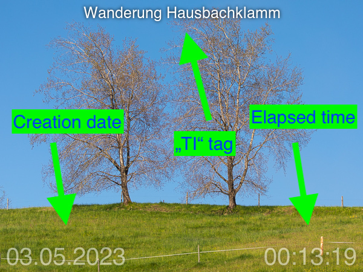
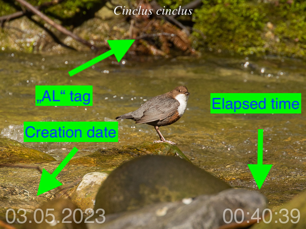
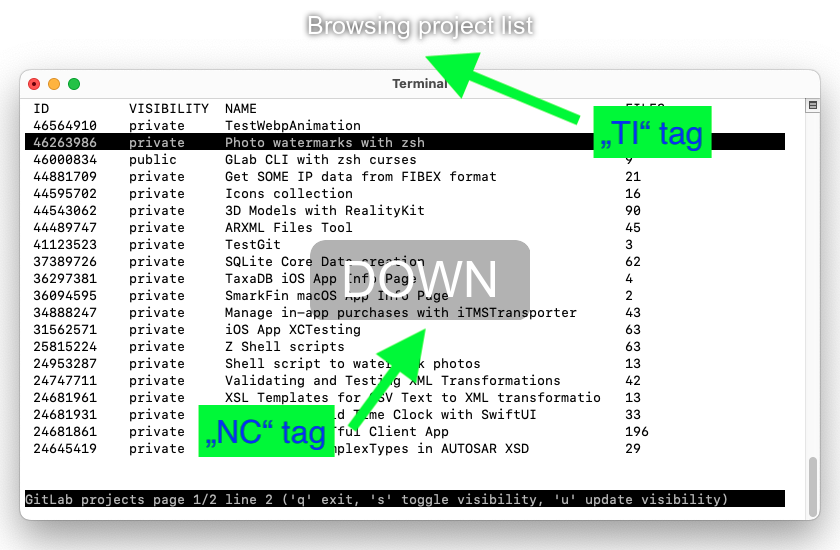

# Watermark photos and create animated Gif and WebP

The [run.zsh](/src/run.zsh) zsh script goes through a series of photos and renames the files in order of the date they were taken, and adds watermarks to them based on the exif information of the photo files.

Optionally, the resulting files can then be used to create animated `Gif` and `WebP`.

## Watermarks

The following watermarks can be added optionally:

- Creation date in `dd.mm.yyyy` format.

- A keyword of a tag `TI`, `NC` or `AL`, which can be created in Adobe Lightroom® ([view](/img/screen01.png)) or with the `exiftool` command like this: `exiftool -P -Keywords="TI:<value>,AL:<value>,NC:<value>" -overwrite_original <path to the photo>/photo.jpg`.

- The elapsed time since the first photo of the photo series in `H:M:S` or `d days H:M:S` format.

<div align="center">

Example with TI Tag          |  Example with AL Tag |  Example with NC Tag
:-------------------------:|:-------------------------:|:-------------------------:
 | | 

</div>

Additionally, the following information is added to each photo as Exif `comment` if available. Example:

    {
        "City":" Oberreute ",
        "State":" Bayern ",
        "Country":" DE",
        "Altitude":" 863.1 m Above Sea Level ",
        "Date":"03.05.2023"
    }

## Animated Gif and WebP

Animated `Gif` and/or `WebP` can be created from the watermarked, ordered, newly created photo files.

With animated `WebP` the duration after which an image changes to the next image can be set for each photo. This can also be controlled with the help of a keyword of a tag (`MS`). For example, the command: `exiftool -Keywords="MS:1000,TI:View of the lake" -overwrite_original ../example/photos/ER6A2996.jpg` sets the duration to one second.

Animated `WebP` have a smaller size and better quality then animated `Gif`. They have been tested on browser like:

<div align="left">

Platform          |  Browser
-------------------------|-------------------------
macOS | Safari Version 16.5
macOS | Chrome Version 114.0.5735.90
Win11 | Edge Version 114.0.1823.37
Ubuntu | Firefox 113.0.2 (64-Bit)

</div>

This can also be used to create a screencast from a series of screenshots.

# Use

## Prerequisites

Before running the script, test if the tools used by the script are available.

### Zsh built-in commands and standard Unix tools used

`zmodload setopt unsetopt zparseopts print command rm cp date mkdir sort tr sed`

### Other third-party tools used

Packages:

- `exiftool`
- `imagemagick` (`convert`, `composite`)
- `cwebp` (`cwebp`, `webpmux`)

These tools usually need to be installed. See installion instructions.

### Zsh Options modified locally

    setopt EXTENDED_GLOB
    setopt NULL_GLOB
    unsetopt NOMATCH

### Zsh Modules loaded locally

    zmodload zsh/zutil

## Setup

### Installation

### `Zsh` - The Z shell

On macOS `zsh` is the standard shell. No installation required.

On Ubuntu 22.04 (or Ubuntu 22.04 based Docker container) using `apt`

    sudo apt-get update
    sudo apt install zsh

### `exiftool` - The ExifTool

On macOS using `brew` as admin:

    brew install exiftool

On Ubuntu 22.04 (or Ubuntu 22.04 based Docker container) using `apt`:

    sudo apt install exiftool

### `imagemagick` - The ImageMagick® Tools

On macOS using `brew` as admin:

    brew install imagemagick

On Ubuntu 22.04 (or Ubuntu 22.04 based Docker container) using `apt`:

    sudo apt install imagemagick

### `cwebp` - The WebP Tools

On macOS using `brew` as admin:

    brew install webp

On Ubuntu 22.04 (or Ubuntu 22.04 based Docker container):

Following the instructions https://developers.google.com/speed/webp/docs/compiling

    sudo apt-get install libjpeg-dev libpng-dev libtiff-dev libgif-dev

Install the build system (`gcc` etc.) if it is not already installed (test with `gcc --version`) (e.g. for Docker images it might not be installed).

    sudo apt install build-essential

Download and untar the latest package version from here: https://storage.googleapis.com/downloads.webmproject.org/releases/webp/index.html (`curl` required ...):

    sudo apt install build-essential
    mkdir ~/tmp
    curl -s -L https://storage.googleapis.com/downloads.webmproject.org/releases/webp/libwebp-1.3.0.tar.gz | tar xvzf - -C ~/tmp
    cd ~/tmp/libwebp-1.3.0/
    ./configure
    make
    sudo make install

To avoid runtime errors, add `/usr/local/lib/` to the environment variable `LD_LIBRARY_PATH`:

    export LD_LIBRARY_PATH=$([[ ${#LD_LIBRARY_PATH} -gt 0 ]] && print "$LD_LIBRARY_PATH:/usr/local/lib/" || print "/usr/local/lib/") 

### Test

Test if the tools and commands are available with `which`.

On macOS start the terminal:

    which zmodload setopt unsetopt zparseopts print command rm cp date mkdir sort tr sed uname
        zmodload: shell built-in command
        setopt: shell built-in command
        unsetopt: shell built-in command
        zparseopts: shell built-in command
        print: shell built-in command
        command: shell built-in command
        /bin/rm
        /bin/cp
        /bin/date
        /bin/mkdir
        /usr/bin/sort
        /usr/bin/tr
        /usr/bin/sed
        /usr/bin/uname
    which exiftool convert composite cwebp webpmux
        /opt/homebrew/bin/exiftool
        /opt/homebrew/bin/convert
        /opt/homebrew/bin/composite
        /opt/homebrew/bin/cwebp
        /opt/homebrew/bin/webpmux

On Ubuntu 22.04 or Ubuntu 22.04 based Docker container:

    zsh
    which zmodload setopt unsetopt zparseopts print command rm cp date mkdir sort tr sed uname
        zmodload: shell built-in command
        setopt: shell built-in command
        unsetopt: shell built-in command
        zparseopts: shell built-in command
        print: shell built-in command
        command: shell built-in command
        /usr/bin/rm
        /usr/bin/cp
        /usr/bin/date
        /usr/bin/mkdir
        /usr/bin/sort
        /usr/bin/tr
        /usr/bin/sed
        /usr/bin/uname
    which exiftool convert composite cwebp webpmux
        /usr/bin/exiftool
        /usr/bin/convert
        /usr/bin/composite
        /usr/local/bin/cwebp
        /usr/local/bin/webpmux

### Download the Script

    mkdir ~/photo-watermarks-with-zsh-main
    curl -s -L https://gitlab.com/ms152718212/photo-watermarks-with-zsh/-/archive/main/photo-watermarks-with-zsh-main.tar.gz | tar xvzf - -C ~/photo-watermarks-with-zsh-main

### Test run and test if the installation was successful

On macOS:

    cd ~/photo-watermarks-with-zsh-main/photo-watermarks-with-zsh-main/
    mkdir Example
    cp -r ExampleC/Photos Example
    ./src/run.zsh -webpanim
            1 image files updated
        New photo created from original ER6A3682.jpg with watermark: ~/photo-watermarks-with-zsh-main/photo-watermarks-with-zsh-main/src/../Example/1686110729/Photos/Watermarked/file-000001.jpg
        ...
            1 image files updated
        New photo created from original ER6A3718-Verbessert-RR.jpg with watermark: ~/photo-watermarks-with-zsh-main/photo-watermarks-with-zsh-main/src/../Example/1686110729/Photos/Watermarked/file-000025.jpg
        Saved file ~/photo-watermarks-with-zsh-main/photo-watermarks-with-zsh-main/src/../Example/1686110729/Photos/Watermarked/animation.webp (2256444 bytes)

On Ubuntu 22.04:

    cd ~/photo-watermarks-with-zsh-main/photo-watermarks-with-zsh-main/
    mkdir Example
    cp -r ExampleC/Photos Example
    ./src/run.zsh -webpanim
        1 image files updated
    New photo created from original ER6A3682.jpg with watermark: ~/photo-watermarks-with-zsh-main/photo-watermarks-with-zsh-main/src/../Example/1686122084/Photos/Watermarked/file-000001.jpg
    ...
        1 image files updated
    New photo created from original ER6A3718-Verbessert-RR.jpg with watermark: ~/photo-watermarks-with-zsh-main/photo-watermarks-with-zsh-main/src/../Example/1686122084/Photos/Watermarked/file-000025.jpg
    Saved file ~photo-watermarks-with-zsh-main/photo-watermarks-with-zsh-main/src/../Example/1686122084/Photos/Watermarked/animation.webp (2256832 bytes)

On Ubuntu 22.04 based Docker container:

    cd ~/photo-watermarks-with-zsh-main/photo-watermarks-with-zsh-main/
    mkdir Example
    cp -r ExampleC/Photos Example
    ./src/run.zsh -webpanim
    ./src/run.zsh -webpanim
        1 image files updated
    New photo created from original ER6A3682.jpg with watermark: /root/photo-watermarks-with-zsh-main/photo-watermarks-with-zsh-main/src/../Example/1686205541/Photos/Watermarked/file-000001.jpg
    ...
        1 image files updated
    New photo created from original ER6A3718-Verbessert-RR.jpg with watermark: /root/photo-watermarks-with-zsh-main/photo-watermarks-with-zsh-main/src/../Example/1686205541/Photos/Watermarked/file-000025.jpg
    Saved file /root/photo-watermarks-with-zsh-main/photo-watermarks-with-zsh-main/src/../Example/1686205541/Photos/Watermarked/animation.webp (2257610 bytes)

Drag the file `animation.webp` into a browser window; you should see that the animated `WebP` is running.

## Command syntax and Exif tags

### Command 

`run.zsh [-gifanim -webpanim -noelapsedtimewm -nodatewm -timewm -nfcwm] [-tz <val>] [-ext <val>]`

<div align="left">

Option          |  Comment
-------------------------|----------------------------------------------------------------
`-gifanim` | Create animated Gif
`-webpanim` | Create animated WebP
`-noelapsedtimewm` | No elapsed time watermark
`-nodatewm` | No capture/creation date watermark
`-timewm` | Add capture/creation time watermark to date watermark
`-nfcwm` | Add a watermark in the middle of the photo with the keystroke information (see Exif tag `NC:<value>`)
`-tz<val>` | Process the photos with time zone set to _\<val\>_; e.g "-4" Miami(US) time zone  or "2" Berlin(DE) daylight saving time zone. There must be *NO* space between `-tz` and `<val>`!
`-ext <val>`|  Consider file with extension _\<val\>_; e.g. "png" "jpeg". Default is "jpg". Multiple `-ext` are possible.

</div>

### Exif tags

The following Exif tags can be used to specify information about how the photo should be processed:

<div align="left">

Tag          |  Value Type | Comment
-------------------------|-------------------------|-----
`TI:<value>` | String (with a few limitations) | Example: `TI:Holiday 2022`. Create a watermark with this value
`AL:<value>` | String (with a few limitations) | Example: `AL:The first day`. Create a watermark with this value
`MS:<value>` | Unsigned Int | Example: `MS:800`. Show this photo as a frame for 800ms in the animated `WebP`
`NC:<value>` | String (with a few limitations) | Example: `NC:ALT-p`. Used with `-nfcwm`

</div>

## Platforms

Installation and running the script successfully tested on

`macOS 13.4` (Darwin 22.5.0) with `zsh 5.9 (x86_64-apple-darwin22.0)` 

`Ubuntu 22.04 LTS` (Linux 5.19.0-43-generic) with `zsh 5.8.1 (x86_64-ubuntu-linux-gnu)`

Ubuntu 22.04 based Docker container, e.g. with Docker image `phusion/baseimage:jammy-1.0.1` and container `mybase`: `docker run --name mybase phusion/baseimage:jammy-1.0.1` with `zsh 5.8.1 (aarch64-unknown-linux-gnu)`

## Run

For each run, a new temporary output directory is created under `destroot` so that existing data is not overwritten. 

In this example and with the given setting, the first step is to copy all photo files from `sourceroot/Photos` to `destroot/<temp dir>/Photos`. 

The resulting watermarked photos have filenames `file-<number>.jpg` and saved in `destroot/<temp dir>/Photos/Watermarked`:

```
./run.zsh
    1 image files updated
New photo created from original ER6A2839.jpg with watermark: /Volumes/SSD01 500/Projekte/watermarks/src/../Example/1684518615/Photos/Watermarked/file-000001.jpg
...
    1 image files updated
New photo created from original ER6A2996.jpg with watermark: /Volumes/SSD01 500/Projekte/watermarks/src/../Example/1684518615/Photos/Watermarked/file-000080.jpg
Done

```

## Customize

There are some settings that might be worth customizing before running the script:

<div align="left">

Script | Parameter |  Comment
-------------------------|:-------------------------:|-------------------------
 `wm.zsh` | `timezone` | The reference time zone. If the photo series contains photos taken with a time zone other than this time zone value, the times of all photos are adjusted to this time zone before they are ordered or time value arithmetic is performed.
 `run.zsh` | `sourceroot` | Absolute path to the input root directory
 `run.zsh` | `destroot` | Absolute path to the output root directory
 `run.zsh` | `sourcedir` | One or more directories under `sourceroot` where the input photos are found
 `run.zsh` | `destdir` | Corresponding output directories under `destroot` (see `sourcedir`)

</div>

Customize ImageMagick® `convert` calls:

<div align="left">

 Script | Option | Comment
-------------------------|:-------------------------:|-------------------------
 `wm.zsh` | `-fill` | Text color
 `wm.zsh` | `-font` | Text font
 `wm.zsh` | `-pointsize` | Font size

</div>

For all options see: 

https://imagemagick.org/script/convert.php

Customize ImageMagick®  `composite` calls:

<div align="left">

 Script file | Option | Comment
-------------------------|:-------------------------:|-------------------------
 `wm.zsh` | `-density` | Resolution of the watermark in dots per inch
 `wm.zsh` | `-dissolve` | Value affects the opacity of the watermark

</div>

For all options see: 

https://imagemagick.org/script/composite.php


# Examples

Example A - Add Watermarks

[README](./ExampleA/)

Example B - Photo series with different time zones

[README](./ExampleB/)

Example C - Animated Gif and WebP

[README](./ExampleC/)

Example D -  Set the time zone

[README](./ExampleD/)

Example E -  Creating a screencast from a screenshot series

[README](./ExampleE/)

Example F -  Creating an animated WebP with an image that is used several times as a frame

[README](./ExampleF/)

# References

https://www.zsh.org

https://brew.sh

https://exiftool.org

https://imagemagick.org

https://imagemagick.org/script/composite.php

https://imagemagick.org/script/convert.php

https://developers.google.com/speed/webp

https://manpages.ubuntu.com/manpages/jammy/de/man8/apt.8.html

https://phusion.github.io/baseimage-docker/#solution
